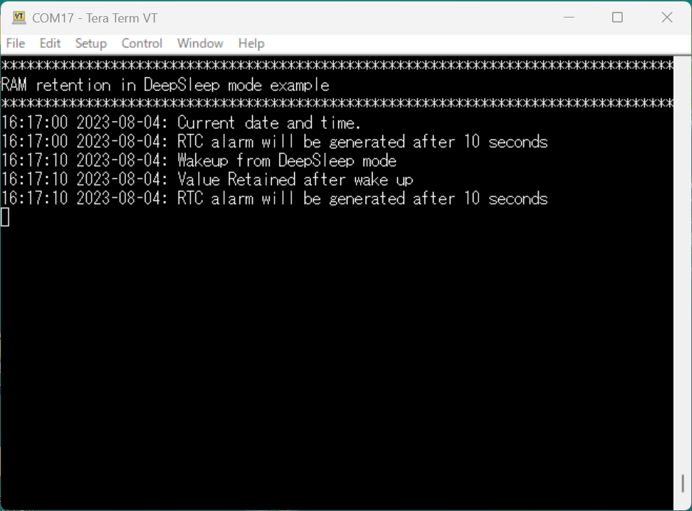

# RAM Retention in DeepSleep Power Mode

**This code example demonstrates how to set RAM into Retention mode before entering DeepSleep mode.**  

## Device

The device used in this code example (CE) is:

- [TRAVEO™ T2G CYT4BF Series](https://www.infineon.com/cms/en/product/microcontroller/32-bit-traveo-t2g-arm-cortex-microcontroller/32-bit-traveo-t2g-arm-cortex-for-body/traveo-t2g-cyt4bf-series/)

## Board

The board used for testing is:

- TRAVEO™ T2G evaluation kit ([KIT_T2G-B-H_EVK](https://www.infineon.com/cms/en/product/evaluation-boards/kit_t2g-b-h_evk/), [KIT_T2G-B-H_LITE](https://www.infineon.com/cms/en/product/evaluation-boards/kit_t2g-b-h_lite/))

## Scope of work
TRAVEO™ T2G MCUs provides the Static RAM (SRAM) Retention function in DeepSleep mode. This code example writes known data into SRAM Controller 1 and sets the SRAM into Retention mode before entering DeepSleep mode. After wakeup from DeepSleep mode, data written to SRAM Controller 1 is read back and compared to the data written before entering DeepSleep mode to check if the data is retained.

## Introduction  

**SRAM Interface**  

- Optional memory size: 1024 KB
- Advanced eXtensible Interface (AXI) bus interfaces:
    - In the fast clock domain for the CM7 CPUs
- Advanced High-performance Bus (AHB)-Lite bus interface:
    - In the slow clock domain for all bus masters (CM0+ CPU, Crypto, P-DMA, M-DMA, debug interface, and optional external bus master). The slow bus infrastructure combines the bus masters in the slow clock domain.
- Programmable wait states.
- Error Correction Code (ECC) function
    - Single-bit error correction and double-bit error detection (SECDED)
    - ECC error injection
- RAM retention function
- RAM power-up delay control
    - Setting the power stabilization wait after switching on the SRAM power domain.

**Device Power Modes**  

The TVII-B-H device can operate in different power modes that are intended to minimize the average power consumption in an application. The power modes supported by TVII-B-H in the order of decreasing power consumption are:
<table border="1" style="border-collapse: collapse">
<thead><tr>
<th>Power Mode</th><th>Description</th><th>Entry Condition</th><th>Wakeup Source</th><th>Wakeup Action</th></tr></thead>
<tbody>
<tr><td><code>Active</code></td><td>Primary mode of operation; all peripherals are available (programmable).</td><td>Wakeup from Sleep/DeepSleep modes, Hibernate reset, or any other reset.</td><td>Not applicable</td><td>Not applicable</td></tr>
<tr><td><code>Low-Power Active Profile</code></td><td>A low-power profile of Active mode; most peripherals are available with limited capabilities</td><td>Register write from Active mode and wakeup from LPSLEEP/DeepSleep 
modes.</td><td>Not applicable</td><td>Not applicable</td></tr>
<tr><td><code>Sleep</code></td><td>CPU is in Sleep mode; all other peripherals are available.</td><td>Register write from Active mode or wakeup from DeepSleep through debugger</td><td>Any interrupt to CPU</td><td>Interrupt</td></tr>
<tr><td><code>Low-Power Sleep Profile</code></td><td>A low-power profile of Sleep mode; CPU is in Sleep mode; most peripherals are available with limited capabilities.</td><td>Register write from LPACTIVE mode.</td><td>Any interrupt to CPU</td><td>Interrupt</td></tr>
<tr><td><code>DeepSleep</code></td><td>All high-frequency clocks and peripherals are turned off. Low-frequency clock (ILO) and low-power analog and digital peripherals are available for operation and as wakeup sources. SRAM can be retained (configurable).</td><td>Register write from Active or LPACTIVE modes.</td><td>GPIO interrupt, event generators, SCB, watchdog timer, and RTC alarms and debugger</td><td> Interrupt or Debug</td></tr>
<tr><td><code>Hibernate</code></td><td>GPIO states are frozen; all high-frequency clocks and peripherals are switched off. Low-frequency clocks (32 kHz), WCO, or LPECO can function. Device resets on wakeup event.</td><td>Register write from Active or LPACTIVE modes.</td><td>WAKEUP pins, RTC alarm, and watchdog timer</td><td> Hibernate Reset</td> </tr>
</tbody>
</table>

More details can be found in [Technical Reference Manual (TRM)](https://www.infineon.com/dgdl/?fileId=5546d4627600a6bc017600bfae720007), [Registers TRM](https://www.infineon.com/dgdl/?fileId=5546d4627600a6bc017600be2aef0004) and [Data Sheet](https://www.infineon.com/dgdl/?fileId=5546d46275b79adb0175dc8387f93228).

## Hardware setup

This CE has been developed for:
- TRAVEO™ T2G evaluation kit ([KIT_T2G-B-H_EVK](https://www.infineon.com/cms/en/product/evaluation-boards/kit_t2g-b-h_evk/)) 
 
No changes are required from the board's default settings.

- TRAVEO™ T2G Body High Lite evaluation kit ([KIT_T2G-B-H_LITE](https://www.infineon.com/cms/en/product/evaluation-boards/kit_t2g-b-h_lite/)) 
 
No changes are required from the board's default settings.

## Implementation

This multi-core application has the main function running on the CM7_0 core.
 - *Power state machine*  

**Setting up RTC as wakeup source**  

This example uses RTC (Real Time Clock) as a wakeup source from DeepSleep mode. The RTC is configured and controlled by HAL (Hardware Abstraction Layer) functions.
- After initializing the RTC by <a href="https://infineon.github.io/mtb-hal-cat1/html/group__group__hal__rtc.html#ga913818691e0a742dea9172d1dc255f5b"><i>cyhal_rtc_init()</i></a>, <a href="https://infineon.github.io/mtb-hal-cat1/html/group__group__hal__rtc.html#ga7cab520a921b70bcdd7794d08c14ce84"><i>cyhal_rtc_write_direct()</i></a> sets the current time and date
- <a href="https://infineon.github.io/mtb-hal-cat1/html/group__group__hal__rtc.html#ga92d82cf6e7ca376c5a41004d2d67cd4d"><i>cyhal_rtc_enable_event()</i></a> enables RTC events that generate RTC interrupts at the specified timing
- In *SetRtcAlarmDateTime()* function, <a href="https://infineon.github.io/mtb-hal-cat1/html/group__group__hal__rtc.html#ga2b3a85af9b9b878e8cae824d5f847b88"><i>cyhal_rtc_set_alarm_by_seconds()</i></a> sets the alarm event occurrence after 10 seconds

**SRAM configuration and transition to DeepSleep mode**  

- After in system initialization is completed, known data is written to SRAM_CONTROLLER1 memory location (0x28080000 to 0x280BFFFF). In main function, Retention mode is enabled before entering DeepSleep mode, and after wakeup from DeepSleep mode via RTC Interrupt (every 10 second interrupt is triggered), SRAM is put in enabled mode. These operations can be done by setting *CPUSS_RAM1_PWR_CTL_PWR_MODE* field.
- The transition to DeepSleep mode is made by a call to <a href="https://infineon.github.io/mtb-hal-cat1/html/group__group__hal__syspm.html#ga0afe7e58c0df4a2eda5010ac628ea981"><i>cyhal_syspm_deepsleep()</i></a>, a HAL function, which manages whether the current MCU state meets the conditions for transition to DeepSleep. In this example, the TX FIFO of the UART used for string output to the terminal should be empty, so <a href="https://infineon.github.io/mtb-hal-cat1/html/group__group__hal__system.html#ga5f450769c1207d98134a9ced39adfdda"><i>cyhal_system_delay_ms()</i></a> is used to wait until it becomes empty.
- After wakeup, the data written in SRAM_CONTROLLER1 memory location is read back to check if data is retained or not. Result is then printed on the terminal and the loop starts again.

**Miscellaneous settings**  

- **STDIN / STDOUT setting**

  - Calling <a href="https://infineon.github.io/retarget-io/html/group__group__board__libs.html#ga21265301bf6e9239845227c2aead9293"><i>cy_retarget_io_init()</i></a> function to use UART as STDIN / STDOUT
    - Initialize the port defined as *CYBSP_DEBUG_UART_TX* as UART TX, defined as *CYBSP_DEBUG_UART_RX* as UART RX (these pins are connected to KitProg3 COM port)
    - The serial port parameters become to 8N1 and 115200 baud
  - In *PrintDebugString()* function, the current time obtained by <a href="https://infineon.github.io/mtb-hal-cat1/html/group__group__hal__rtc.html#ga5c3f15f870f2ecfb4a8a03a58d1eaa5f"><i>cyhal_rtc_read()</i></a> is output to the terminal along with a debug string

**Cores other than CM7_0**

Since all cores must transition to DeepSleep for the entire system becomes DeepSleep mode, cores other than CM7_0 are provided as projects to explicitly transition to DeepSleep.

## Run and Test

For this CE, a terminal emulator is required for displaying outputs. Install a terminal emulator if you do not have one. Instructions in this document use [Tera Term](https://ttssh2.osdn.jp/index.html.en).

After code compilation, perform the following steps to flashing the device:

1. Connect the board to your PC using the provided USB cable through the KitProg3 USB connector.
2. Open a terminal program and select the KitProg3 COM port. Set the serial port parameters to 8N1 and 115200 baud.
3. Program the board using one of the following:
    - Select the CE project in the Project Explorer.
    - In the **Quick Panel**, scroll down, and click **[Project Name] Program (KitProg3_MiniProg4)**.
4. After programming, the CE starts automatically. Confirm that the messages are displayed on the UART terminal.

    - *Terminal output on program startup* 

5. You can debug the example to step through the code. In the IDE, use the **[Project Name] Debug (KitProg3_MiniProg4)** configuration in the **Quick Panel**. For details, see the "Program and debug" section in the [Eclipse IDE for ModusToolbox™ software user guide](https://www.infineon.com/dgdl/?fileId=8ac78c8c8386267f0183a8d7043b58ee).

**Note:** **(Only while debugging)** On the CM7 CPU, some code in *main()* may execute before the debugger halts at the beginning of *main()*. This means that some code executes twice: once before the debugger stops execution, and again after the debugger resets the program counter to the beginning of *main()*. See [KBA231071](https://community.infineon.com/t5/Knowledge-Base-Articles/PSoC-6-MCU-Code-in-main-executes-before-the-debugger-halts-at-the-first-line-of/ta-p/253856) to learn about this and for the workaround.

## References  

Relevant Application notes are:

- AN235305 - GETTING STARTED WITH TRAVEO™ T2G FAMILY MCUS IN MODUSTOOLBOX™
- [AN220222](https://www.infineon.com/dgdl/?fileId=5546d462749a7c2d01749b357cbc0ce6) - Low Power Mode Procedure in Traveo II Family
- [AN220152](https://www.infineon.com/dgdl/Infineon-Infineon-How-to-Retain-RAM-Data-with-Software-Reset-and-Low-Power-Mode-Transition-in-Traveo-II-Family-ApplicationNotes-v01_00-EN.pdf?fileId=5546d462749a7c2d01749b35f7020cfa) - How to Retain RAM Data in Reset Procedure and Low-Power Mode Transition in Traveo II Family

ModusToolbox™ is available online:
- <https://www.infineon.com/modustoolbox>

Associated TRAVEO™ T2G MCUs can be found on:
- <https://www.infineon.com/cms/en/product/microcontroller/32-bit-traveo-t2g-arm-cortex-microcontroller/>

More code examples can be found on the GIT repository:
- [TRAVEO™ T2G Code examples](https://github.com/orgs/Infineon/repositories?q=mtb-t2g-&type=all&language=&sort=)

For additional trainings, visit our webpage:  
- [TRAVEO™ T2G trainings](https://www.infineon.com/cms/en/product/microcontroller/32-bit-traveo-t2g-arm-cortex-microcontroller/32-bit-traveo-t2g-arm-cortex-for-body/traveo-t2g-cyt4bf-series/#!trainings)

For questions and support, use the TRAVEO™ T2G Forum:  
- <https://community.infineon.com/t5/TRAVEO-T2G/bd-p/TraveoII>  
